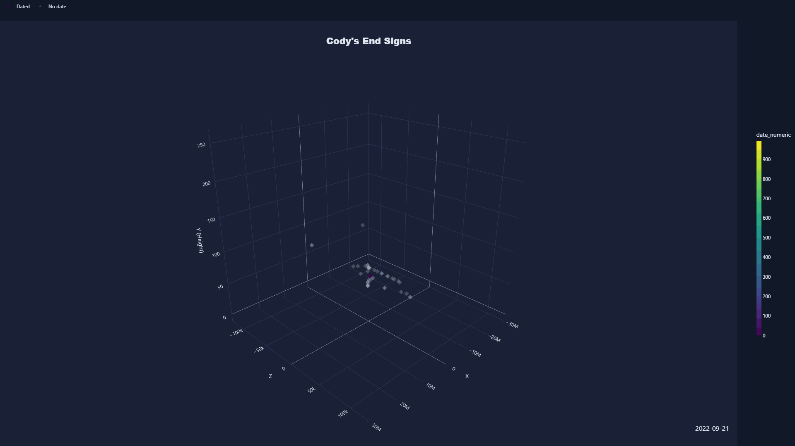

# Minecraft Sign Speak

---
A 2b2t sign visualizer tool made by lawnguy with the help of Claude to speed things up, using the 1mill squared data provided to the public. 

---

## Features 

---

- 3d plot visualiser 
- cluster view 
(Puts signs into clusters that you can view through to help FormEncode of large quantities of signs)
- Animation Export (Only for cody signs)
- Text Filter 
- Cody Sign Viewer

## Animations

---
**Day by Day of Cody Signs Placed In The End.**

## Pictures

---
**Interesting Plot From One Player Placing This All in ~2 Days.**

